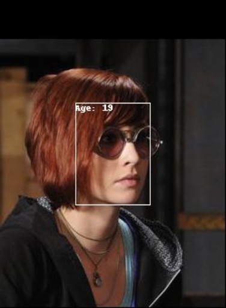
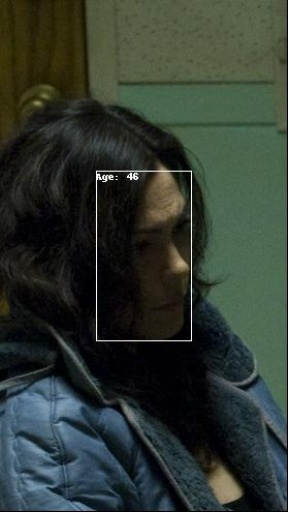

# IMDB-Clean: A Novel Benchmark for Age Estimation in the Wild
Scripts for creating the IMDB-Clean dataset for age estimation and gender classification. 

If you use this repository in your research, we kindly rquest you to cite the following paper:
```
```


## Introduction

We have cleaned the noisy [IMDB-WIKI](https://data.vision.ee.ethz.ch/cvl/rrothe/imdb-wiki/) dataset using a constrained clustering method, resulting this new benchmark for in-the-wild age estimation. The annoations also allow this dataset to used for some other tasks, like gender classification and face recognition/verification. For more detailed introduction


## How to use
Clone this repo, install the python requirements and run the script:
```bash
pip install -r ./requirements.txt
bash run_all.sh
```
This will download the original images from the [IMDB-WIKI](https://data.vision.ee.ethz.ch/cvl/rrothe/imdb-wiki/) dataset. The file tree would become the following:

```
data
├── imdb
├── imdb-clean-1024
├── imdb-clean-1024-visualisation
csvs
├── imdb_test_new.csv
├── imdb_train_new.csv
├── imdb_valid_new.csv
├── imdb_test_new_1024.csv
├── imdb_train_new_1024.csv
└── imdb_valid_new_1024.csv
```

The cropped images are stored in `imdb-clean-1024` and the annotations for the splits are in `imdb_*_new_1024.csv` which you can use to train age/gender estimation models. The images in `imdb-clean-1024-visualisation` are some sample results, for example:






## Disclaimer 
We only provide new annotations under MIT licence. The images are from the [IMDB-WIKI](https://data.vision.ee.ethz.ch/cvl/rrothe/imdb-wiki/) dataset. We do not own any of these images. Please refer to their website for the licence to use these images.
